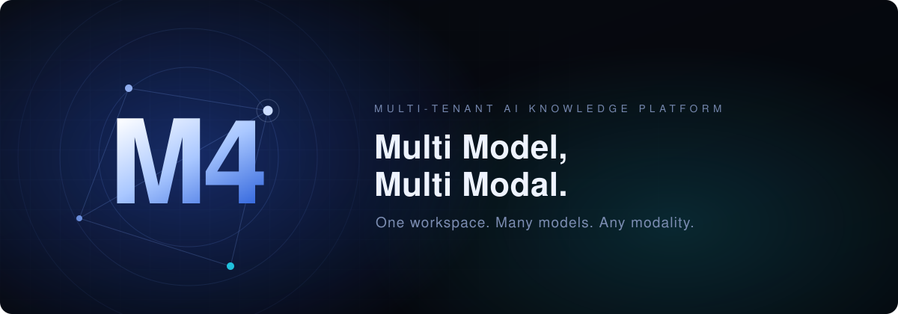

<p align="center">
  
</p>

<h1 align="center">M4</h1>
<p align="center"><strong>Multi Model, Multi Modal.</strong><br>One workspace. Many models. Any modality.</p>

---

## Overview

**M4** is a multi-tenant SaaS web application built for use by multiple companies on a shared platform.

Chatting with an LLM is the core experience, combined with **RAG search** over internal documents.
Knowledge that would otherwise stay scattered across people and formats — text, images, and more —
is turned into shared, accumulated knowledge. The effort of hunting for it is absorbed by RAG search.

### Behind the name

| Name | Meaning |
| --- | --- |
| **Multi Model** | Pick the LLM to use right from the UI (OpenAI, Gemini, and more) |
| **Multi Modal** | Handle modalities beyond text in one unified experience |

## Features

- **Multi-tenancy** — Multiple companies share one platform while staying isolated from each other
- **LLM chat** — Conversation is the primary interface; every exchange is kept as history
- **Model selection** — Switch the LLM in use from the screen
- **Multi-modal input and output** — Images and other modalities alongside text
- **RAG search** — Search internal documents across the tenant and ground answers in them
- **Tenant-wide knowledge** — Uploaded files are shared within the tenant. There is no private per-user space, because allowing one would let knowledge become siloed again

## Tech Stack

TypeScript everywhere. Backend and frontend live together in this single repository as a
**pnpm workspaces monorepo** — `apps/` holds what runs, `packages/` holds what is shared —
with a **BFF (Backend For Frontend)** layer between the frontend and the services behind it.

```
M4 (pnpm workspaces monorepo)
├── Next.js (App Router)
│   ├── React
│   ├── Tailwind CSS
│   │
│   └── BFF
│       └── tRPC
│
├── Prisma
│   └── PostgreSQL
│
├── LLM
│   ├── OpenAI
│   └── Gemini
│
├── Docker
│   └── PostgreSQL (local container)
│
└── Testing
    ├── Vitest
    └── Playwright
```

| Layer | Technology | Version |
| --- | --- | --- |
| Language | TypeScript | 5.9 |
| Runtime | Node.js | 22 LTS |
| Package manager | pnpm (workspaces) | 9.15 |
| Frontend | Next.js (App Router) / React / Tailwind CSS | 15.5 / 19.2 / 4.3 |
| BFF | tRPC | 11.18 |
| ORM | Prisma | 6.19 |
| Database | PostgreSQL (with pgvector) | 17 |
| LLM | OpenAI / Gemini | `openai` 4.104 / `@google/genai` 1.52 |
| Local development | Docker Compose | — |
| Testing | Vitest (unit and integration) / Playwright (E2E) | 3.2 / 1.63 |
| Static analysis | ESLint / Prettier | 9.39 / 3.9 |

Versions are indicative; `package.json` and `pnpm-lock.yaml` are the source of truth.

> Infrastructure (AWS, GCP, and so on) is deferred. Local development with Docker Compose comes first.

### Repository layout

```
m4/
├── apps/
│   └── web/          Next.js (App Router) — UI and the tRPC BFF
├── packages/
│   ├── db/           Prisma schema, migrations, shared PrismaClient
│   └── config/       Shared ESLint and TypeScript configuration
└── docker/           Local PostgreSQL (pgvector) via Docker Compose
```

## Getting Started

Requires Node.js 20.11+ (see `.nvmrc`), [pnpm](https://pnpm.io) and Docker.

```bash
cp .env.example .env      # then fill in OPENAI_API_KEY and GEMINI_API_KEY
pnpm install
pnpm db:up                # start PostgreSQL in Docker
pnpm db:generate          # generate the Prisma client
pnpm db:push              # apply the schema
pnpm dev                  # http://localhost:3000
```

| Command | What it does |
| --- | --- |
| `pnpm dev` | Run the Next.js dev server |
| `pnpm build` | Production build |
| `pnpm lint` / `pnpm format` | ESLint / Prettier |
| `pnpm typecheck` | TypeScript, no emit |
| `pnpm test` | Vitest (unit and integration) |
| `pnpm test:e2e` | Playwright (E2E) |
| `pnpm check` | Everything CI runs, in one go |
| `pnpm db:up` / `pnpm db:down` / `pnpm db:reset` | Local PostgreSQL container |
| `pnpm db:migrate` / `pnpm db:studio` | Prisma migrations / Studio |

## Design

- Styling with **Tailwind CSS**
- A **dark** base tone throughout
- Everything else is decided as it comes up

## Development Rules

- Driven by **GitHub Spec Kit**, following **SDD (Spec Driven Development)** and **AI-DLC**
- **A spec is the default, not a ritual.** Work carrying real design decisions goes through a spec first; small or self-evident changes may simply be written. Judgement over ceremony
- **Humans write zero lines of code** — the implementation is entirely AI-authored
- Work starts from a **GitHub issue**, on a branch cut from `main`, and lands through a **pull request into `main`**
- Branches are named `<type>/<issue-number>-<short-description>` — for example `feature/12-model-selector` or `chore/3-tech-stack-setup`
- Detailed conventions for AI contributors live in [`CLAUDE.md`](CLAUDE.md)

## Out of Scope

- No language support beyond Japanese and English
- Multi Modal is the goal, but **video is not supported for now** (it may be added later)
